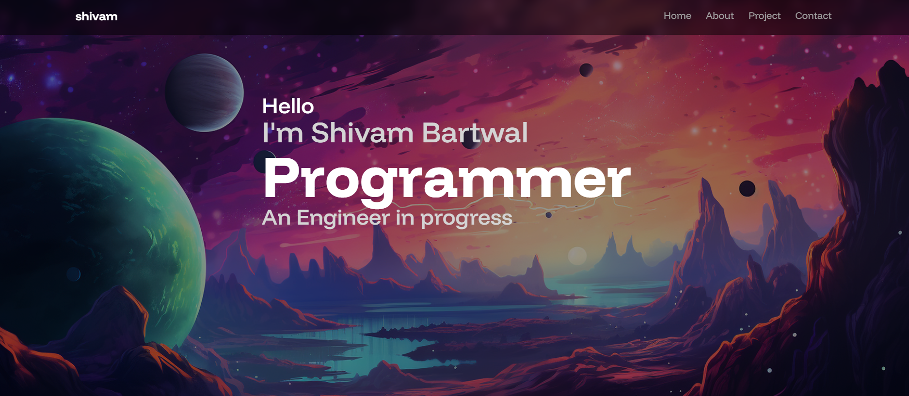

# 🚀 Shivam Bartwal - Developer Portfolio

Welcome to my personal portfolio website built using modern React practices. This project showcases my work, skills, tech stack, and provides a way for visitors to connect with me. It combines interactive animations, responsive design, and modular components for a smooth user experience.

 

## 📌 Features

- 🧭 Smooth navigation with a responsive navbar
- 💫 Hero section with particle effects and parallax background
- 👤 "About Me" with dynamic cards and tech stack visualization
- 🧠 Projects grid showcasing selected work
- 💌 Contact form with email functionality
- 🎨 Reusable components for scalability and ease of development

## 🛠️ Tech Stack

- **React** – UI rendering and component-based design  
- **Framer Motion** – Animations and transitions  
- **Tailwind CSS** – Styling and layout  
- **Vite** – Frontend build tool  
- **JSX** – Syntax for defining UI components  
